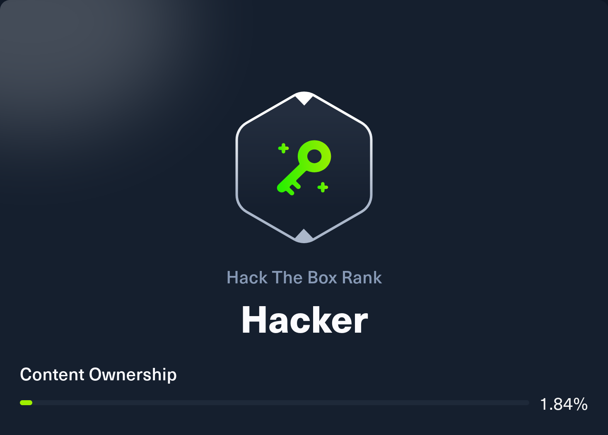
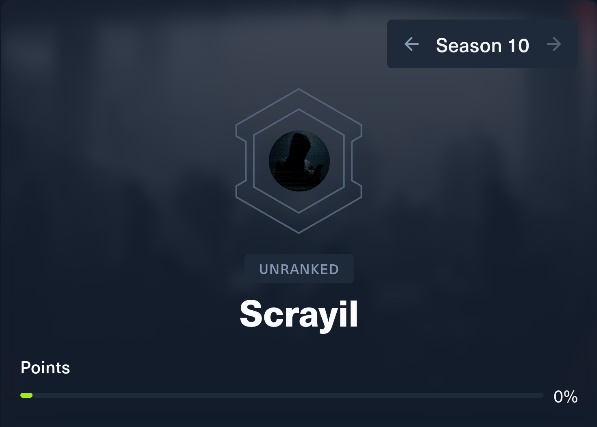
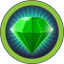
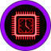
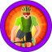
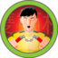
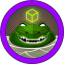
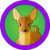
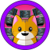
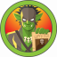

# 🌱 Mattia Bennati - Scrayil
> **Creator and exploiter of digital content (IT Engineer/Developer/Hacker/Animal Rights Advocate)**

I am a computer engineer enrolled in a master's degree course in AI at the University of Florence.  
I love the world of cybersecurity and I'm gradually immersing myself in it in my free time.  
I am currently studying and working as a part-time developer, while in my spare time I focus on personal projects 
involving application development, hacking, and video editing.  
I am passionate about everything related to computer science and the animal kingdom, and I also love learning new things 
and technologies every day.

&nbsp;&nbsp;&nbsp;&nbsp;&nbsp;
&nbsp;&nbsp;&nbsp;&nbsp;&nbsp;
&nbsp;&nbsp;&nbsp;&nbsp;&nbsp;
&nbsp;&nbsp;&nbsp;&nbsp;&nbsp;
&nbsp;&nbsp;&nbsp;&nbsp;&nbsp;

---
### ⚒️ Languages and tools I use(ed)

    
    
    
    
    
    
    
    
    
    
    
    
    
    
    

    
    
    
    
    
    
    
    
    
    
    
    
    
    
    
     
    
    
    
    
    
    
    
    
    
    

---
### 👨🏻‍💻 HTB

  

---
### 📈 Stats

  

---
### 🪪 Badges

  
  

---

    
🎯 Rooted Machines

<!-- HTB Activities-Start -->
 
    
    
    
    
    
    
    
    
    
    
    
    
    
    
    
    
    
    
    
    
    
    
    
    
    
    
    
    
    
    
    
    
    
    
    
    
    
    
    
    
    
    
    
    
    
    
    
    
    
    
    
    
    
    
    
    
    
    
    
<!-- HTB Activities-Stop --> 

